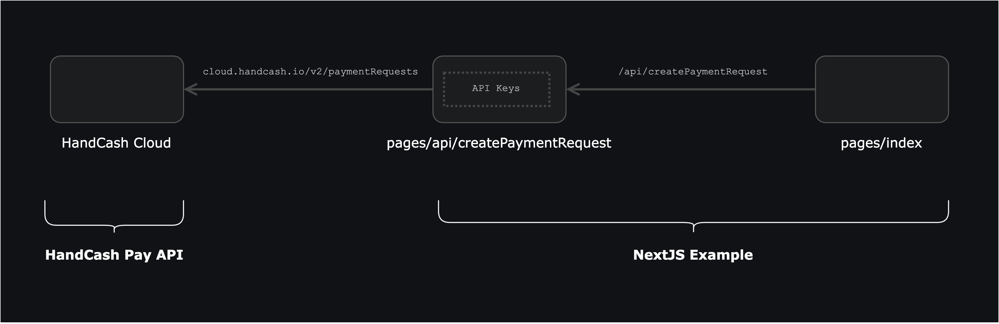
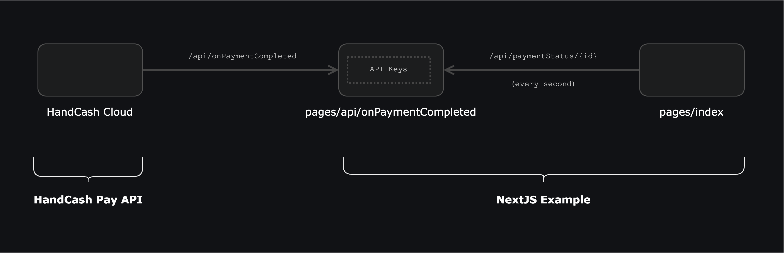

## Run the demo

A demo of this project is available in following link: https://handcash-pay-nextjs-example.vercel.app

## Getting Started

First, create your app at [https://dashboard.handcash.io](https://dashboard.handcash.io) or grab the credentials from your existing app.


Add your app credentials to `.env.local`:

```bash
APP_SECRET=your_app_secret
APP_ID=your_app_id
SERVER_DOMAIN=yourDomain_or_empty_if_you_deploy_on_vercel
```

Install the dependencies:
```bash
npm install
# or
yarn install
```

Run the development server:

```bash
npm run dev
# or
yarn dev
```

Open [http://localhost:3000](http://localhost:3000) with your browser to see the result.

In order to receive notification webhooks when a payment is completed, you need your server to be reachable externally (aka a public IP). You can get a public IP using [ngrok](https://ngrok.com/).
Once you have your public IP, add the domain to your `.env.local` file:

```bash
SERVER_DOMAIN=yourDomain_or_empty_if_you_deploy_on_vercel
// Do not paste the full ngrok URL, just the domain. 

// This is wrong ❌
SERVER_DOMAIN=https://123456.ngrok.io

// This is correct ✅
SERVER_DOMAIN=123456.ngrok.io
```


## Tutorial

### Overview

There are 3 clear layers that interact with each other in this project:
1) **HandCash Cloud**: it provides the HandCash Pay API to manage payment requests and the webhooks to notify when a payment is completed.
2) **pages/api**: the Next.js API routes that handle the communication with HandCash Cloud.
3) **pages**: the React components that render the UI and call the Next.js API routes.



> Notice that we don't call HandCash Cloud directly from the React components. This is because we can't expose the app secret to the client.

The internal API only requires our custom parameters to create a payment request.

```javascript
// pages/index.jsx
export default function Index() {
    const onConfirmPaymentAmount = async () => {
        const response = await fetch(`api/createPaymentRequest`, {
            method: 'POST',
            body: JSON.stringify({
                sendAmount: inputAmount,
                currencyCode: 'USD',
                destination: settings?.destination,
                businessName: settings?.businessName,
                notificationsEmail: settings?.notificationsEmail,
            }),
        });
        if (response.ok) {
            const payment = await response.json();
        }
    };
}
```

Later, we compose a request that follows the HandCash Pay API specification.
```javascript
// pages/api/createPaymentRequest.js
export default async function handler(req, res) {
    try {
        const {sendAmount, destination, currencyCode, businessName, notificationsEmail} = JSON.parse(req.body);
        const data = await HandCashService.createPaymentRequest({
            businessName,
            sendAmount,
            destination,
            currencyCode,
            notificationsEmail
        });
        ...
        return res.status(200).json(data);
    } catch (error) {
        console.error(error);
        return res.status(400).json({error: error.toString()});
    }
}
```

Whereas:
```javascript
// lib/services/HandCashConnectService.js
const appId = process.env.APP_ID;
const appSecret = process.env.APP_SECRET;
const serverDomain = process.env.VERCEL_URL || process.env.SERVER_DOMAIN;
const baseEndpoint = 'https://cloud.handcash.io/v2';

export default class HandCashService {
    static headers = {
        'app-id': appId,
        'app-secret': appSecret,
    };

    static async createPaymentRequest({businessName, sendAmount, destination, currencyCode, notificationsEmail}) {
        const response = await fetch(`${baseEndpoint}/paymentRequests`, {
            method: 'POST',
            headers: this.headers,
            body: JSON.stringify({
                requestedUserData: ['paymail'],
                expirationType: 'onPaymentCompleted',
                product: {
                    name: businessName,
                    description: '',
                    imageUrl: 'https://resources.paymentexpert.com/paymentexpert/2019/05/shutterstock_311420912-1068x1068.jpg',
                },
                receivers: [
                    {sendAmount, currencyCode, destination}
                ],
                notifications: {
                    webhook: {
                        webhookUrl: `https://${serverDomain}/api/onPaymentCompleted`,
                    },
                    email: notificationsEmail || undefined,
                }
            }),
        });
        return this.parseResponse(response);
    };

    static async parseResponse(response) {
        if (response.ok) {
            return response.json();
        } else {
            const errorMessage = await response.text();
            throw Error(errorMessage);
        }
    }
}
```

### Updating the payment status
Once a payment is completed, HandCash Cloud will send a webhook to our server. We need to update the payment status in our server and update the UI accordingly.

This example implements the polling pattern to update the payment status. From the React pages call `/api/paymentStatus/{id}` every second until the payment is completed.

1) HandCash Cloud sends a webhook to our server under `/api/onPaymentCompleted`.
2) Our server updates the payment status in the system.
3) The React pages call `/api/paymentStatus/{id}` every second until the payment is completed.



In case the user aborts the payment, the React pages will stop calling `/api/paymentStatus/{id}`. Additionally, a call to `/api/deletePaymentRequest` will be made to delete the payment request from HandCash Cloud.

```javascript
// pages/api//onPaymentCompleted.js
import PaymentsRepository from "../../lib/repositories/PaymentsRepository";
import {paymentStatus} from "../../lib/Entities";

const appSecret = process.env.APP_SECRET;

export default function handler(req, res) {
    try {
        const data = req.body;
        if (data.appSecret === appSecret) {
            const paymentRequest = PaymentsRepository.getById(data.paymentRequestId);
            const username = data.userData.paymail.split('@')[0];
            PaymentsRepository.setById(data.paymentRequestId, {
                status: paymentStatus.confirmed,
            })
            // We update the payment status along with some other relevant information
            PaymentsRepository.addPaymentCompleted({
                transactionId: data.transactionId,
                status: paymentStatus.confirmed,
                paymentAmount: paymentRequest?.paymentAmount,
                confirmedAt: new Date(),
                userData: {
                    username,
                    avatarUrl: `https://cloud.handcash.io/v2/users/profilePicture/${username}`,
                },
            });
        }
        return res.status(200).json({});
    } catch (error) {
        console.error(error);
        return res.status(500).json({});
    }
}
```

The endpoint to get the payment status is implemented as follows:
```javascript
// pages/api/paymentStatus/[id].js
import PaymentsRepository from "../../../lib/repositories/PaymentsRepository";
import {paymentStatus} from "../../../lib/Entities";

export default function handler(req, res) {
  const {id} = req.query;
  const payment = PaymentsRepository.getById(id);
  return res.status(200).json({ status: payment?.status || paymentStatus.unknown });
}
```

### Learn More

To learn more about HandCash Pay, take a look at the following resources:

- [HandCash Pay Documentation](https://docs.handcash.io/docs/overview) - learn about their main features.

## Deploy on Vercel

The easiest way to deploy your Next.js app is to use the [Vercel Platform](https://vercel.com/new) from the creators of Next.js.

Check out our [Next.js deployment documentation](https://nextjs.org/docs/deployment) for more details.
